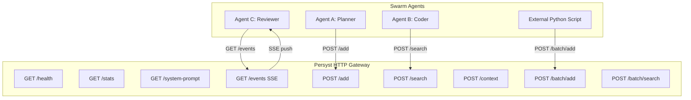

# 🔌 Persyst Swarm Connection Specification

This specification documents all HTTP endpoints, authentication, event streaming, and namespace patterns for running reliable local-first or remote **Agent Swarms** integrated with the Persyst Memory Gateway.

---

## 🏗️ Architecture Overview



---

## ⚙️ Environment Configuration

| Variable | Default | Description |
|---|---|---|
| `PORT` | `4321` | HTTP Gateway port |
| `PERSYST_HOST` | `127.0.0.1` | Bind address. Use `0.0.0.0` for Docker/remote access |
| `PERSYST_API_KEY` | *(unset)* | Optional auth token. If set, all endpoints except `/health` require `Authorization: Bearer <token>` |

### Docker example
```bash
PERSYST_HOST=0.0.0.0 PERSYST_API_KEY=mysecretkey npx persyst-mcp
```

### Accessing from another host
```bash
curl -H "Authorization: Bearer mysecretkey" http://192.168.1.100:4321/health
```

---

## 📡 HTTP API Reference

All `POST` requests must include `Content-Type: application/json`.  
If `PERSYST_API_KEY` is set, all requests (except `/health`) require the header `Authorization: Bearer <key>`.

---

### `GET /health` — Server Liveness Check
Use this in Docker health checks and swarm orchestrators to verify the server is alive before sending work.

**Always public — no auth required.**

```bash
curl http://127.0.0.1:4321/health
```

**Response:**
```json
{
  "ok": true,
  "version": "2.2.6",
  "uptime_seconds": 3600,
  "memories": 142,
  "sse_clients": 3
}
```

---

### `GET /stats` — Memory & Agent Statistics

```bash
curl http://127.0.0.1:4321/stats
```

**Response:**
```json
{
  "uptime_seconds": 3600,
  "namespaces": [
    { "namespace": "shared", "count": 100 },
    { "namespace": "coder-agent", "count": 42 }
  ],
  "agents": [
    { "agent_id": "planner-agent", "memories_added": 50, "reputation_score": 0.92 },
    { "agent_id": "coder-agent", "memories_added": 42, "reputation_score": 0.88 }
  ]
}
```

---

### `GET /system-prompt` — Pre-Formatted IDE Injection Block

The most reliable injection mechanism. Returns a ready-to-paste memory block for any IDE's Custom Instructions / System Prompt field. Requires **zero MCP setup** on the agent side.

**Query parameters:**
| Param | Default | Description |
|---|---|---|
| `query` | `"project conventions architecture preferences rules stack decisions"` | Search query |
| `max_tokens` | `1500` | Token budget |
| `agent_id` | *(none)* | Restrict to this agent's namespace |
| `format` | `text` | `text` \| `markdown` \| `json` |

```bash
# Plain text (paste into IDE custom instructions)
curl "http://127.0.0.1:4321/system-prompt"

# Markdown format
curl "http://127.0.0.1:4321/system-prompt?format=markdown&max_tokens=2000"

# Agent-specific context
curl "http://127.0.0.1:4321/system-prompt?agent_id=cursor-agent&format=markdown"
```

**Example plain text response:**
```
=== PERSYST MEMORY CONTEXT ===
Updated: 2026-06-22 19:39 | 8 memories

[RULES & CONVENTIONS]
• Rule: Always use camelCase for variables
• Config: SSL certificate path must be included

[ARCHITECTURE & STACK]
• Stack: SQLite + better-sqlite3 for local database

[DECISIONS]
• Decision: MCP over stdio for AI agent communication

=== END MEMORY CONTEXT ===
Refresh: curl http://127.0.0.1:4321/system-prompt
```

**How to use in Cursor:** Settings → Rules → paste the `curl` output.  
**How to use in Windsurf:** `.windsurfrules` → add the output as static context at the top.

---

### `GET /events` — Real-Time SSE Event Stream

Subscribe once and receive push notifications for all memory changes. No polling required.

**Events emitted:**
| Event | Payload |
|---|---|
| `connected` | `{ ok: true, timestamp, server_version }` |
| `memory_added` | `{ id, content, namespace, source }` |
| `memory_deleted` | `{ id }` |
| `memories_consolidated` | `{ consolidated_groups, details }` |
| `server_shutdown` | `{ message }` |
| *(comment)* | `: heartbeat` — every 15s to keep connection alive |

**Python (sseclient):**
```python
import sseclient, requests

def subscribe_to_memory_events():
    url = "http://127.0.0.1:4321/events"
    headers = {"Authorization": "Bearer mysecretkey"}  # if PERSYST_API_KEY is set
    response = requests.get(url, headers=headers, stream=True)
    client = sseclient.SSEClient(response)
    
    for event in client.events():
        if event.event == "memory_added":
            import json
            data = json.loads(event.data)
            print(f"New memory #{data['id']}: {data['content'][:60]}")
        elif event.event == "memory_deleted":
            import json
            data = json.loads(event.data)
            print(f"Memory #{data['id']} deleted")
```

**Node.js:**
```javascript
const EventSource = require('eventsource');
const es = new EventSource('http://127.0.0.1:4321/events');

es.addEventListener('memory_added', (e) => {
  const data = JSON.parse(e.data);
  console.log(`Memory #${data.id} added: ${data.content.slice(0, 60)}`);
});
```

---

### `POST /add` — Store a Single Memory

```json
{
  "content": "Database migrations must always use the knex migration library.",
  "importance": 0.9,
  "agent_id": "architect-agent",
  "session_id": "session_8f90a",
  "shared": true
}
```

**Response:**
```json
{
  "success": true,
  "id": 142,
  "content": "Database migrations must always use the knex migration library.",
  "namespace": "shared"
}
```

---

### `POST /batch/add` — Store Multiple Memories (One Round Trip)

**Maximum 200 memories per request.**

```json
{
  "memories": [
    { "content": "Use TypeScript for all new files", "importance": 0.9, "agent_id": "coder" },
    { "content": "Port is set to 4321", "importance": 0.8, "agent_id": "coder" },
    { "content": "Authentication uses JWT with 24h expiry", "importance": 0.95 }
  ]
}
```

**Response:**
```json
{
  "success": true,
  "stored": 2,
  "skipped": 1,
  "errors": 0,
  "results": [...]
}
```

**Use case:** CI/CD pipeline storing build results, test outcomes, deployment metadata in one call.

---

### `POST /search` — Hybrid Keyword + Semantic Search

```json
{
  "query": "Which database migration tool are we using?",
  "limit": 5,
  "agent_id": "coder-agent"
}
```

**Response:**
```json
{
  "success": true,
  "results": [
    {
      "id": 142,
      "content": "Database migrations must always use the knex migration library.",
      "similarity": 0.88,
      "created_at": 1781646206
    }
  ]
}
```

---

### `POST /batch/search` — Multiple Queries (One Round Trip)

**Maximum 50 queries per request. Queries run in parallel.**

```json
{
  "queries": [
    "database migration tool",
    "authentication method",
    { "query": "CSS conventions", "agent_id": "frontend-agent", "limit": 3 }
  ],
  "limit": 5
}
```

**Response:**
```json
{
  "success": true,
  "results": {
    "database migration tool": [...],
    "authentication method": [...],
    "CSS conventions": [...]
  }
}
```

**Use case:** Swarm orchestrator loading context for all active agents in one request at swarm startup.

---

### `POST /context` — Compressed Context Block for LLM

```json
{
  "query": "Current database tech stack and conventions",
  "max_tokens": 2000,
  "agent_id": "coder-agent",
  "intent": "database_management"
}
```

**Response:**
```json
{
  "context": "=== RETRIEVED AGENT MEMORY CONTEXT ===\n...",
  "memories": [...],
  "attestation": {...},
  "intent": "database_management",
  "urgency": "low",
  "suggested_actions": ["Review migration history before making schema changes"]
}
```

---

### `POST /tool` — Generic MCP Tool Invocation

Call any registered MCP tool directly via HTTP (no MCP protocol required).

```json
{
  "name": "ingest_git_commits",
  "arguments": { "repo_path": "/path/to/repo", "count": 50 }
}
```

---

### `POST /verify` — Chain Integrity Verification

Verifies the Ed25519 attestation chain hasn't been tampered with.

```bash
curl -X POST http://127.0.0.1:4321/verify
```

---

## 🔒 Namespace Isolation & Sharing

| Mode | `shared` param | Behavior |
|---|---|---|
| Shared workspace | `true` (default) | Visible to all agents in the swarm |
| Agent-isolated | `false` | Only visible to the writing agent (by `agent_id`) |

---

## 💻 Complete Python Swarm Client

```python
import requests
import json
from typing import List, Dict, Any, Optional

class PersystSwarmClient:
    """
    Production-ready Persyst client for agentic swarms.
    Supports health checking, auth, batch ops, and SSE events.
    """
    
    def __init__(self, host: str = "127.0.0.1", port: int = 4321, api_key: Optional[str] = None):
        self.base_url = f"http://{host}:{port}"
        self.session = requests.Session()
        if api_key:
            self.session.headers["Authorization"] = f"Bearer {api_key}"
        self.session.headers["Content-Type"] = "application/json"

    def is_alive(self) -> bool:
        """Check if the Persyst server is running."""
        try:
            r = requests.get(f"{self.base_url}/health", timeout=1.0)
            return r.status_code == 200 and r.json().get("ok", False)
        except requests.exceptions.RequestException:
            return False

    def add(self, content: str, agent_id: str = None, importance: float = 1.0, shared: bool = True) -> Dict:
        try:
            r = self.session.post(f"{self.base_url}/add", json={
                "content": content, "agent_id": agent_id, "importance": importance, "shared": shared
            }, timeout=5.0)
            return r.json()
        except Exception as e:
            return {"error": str(e)}

    def batch_add(self, memories: List[Dict]) -> Dict:
        """Store up to 200 memories in one round trip."""
        try:
            r = self.session.post(f"{self.base_url}/batch/add", json={"memories": memories}, timeout=30.0)
            return r.json()
        except Exception as e:
            return {"error": str(e)}

    def search(self, query: str, agent_id: str = None, limit: int = 5) -> List[Dict]:
        try:
            r = self.session.post(f"{self.base_url}/search", json={
                "query": query, "agent_id": agent_id, "limit": limit
            }, timeout=5.0)
            return r.json().get("results", [])
        except Exception:
            return []

    def batch_search(self, queries: List[str], limit: int = 5) -> Dict[str, List]:
        """Run multiple queries in parallel in one request."""
        try:
            r = self.session.post(f"{self.base_url}/batch/search", json={
                "queries": queries, "limit": limit
            }, timeout=10.0)
            return r.json().get("results", {})
        except Exception:
            return {}

    def context(self, query: str, agent_id: str = None, max_tokens: int = 2000) -> str:
        try:
            r = self.session.post(f"{self.base_url}/context", json={
                "query": query, "agent_id": agent_id, "max_tokens": max_tokens
            }, timeout=5.0)
            return r.json().get("context", "")
        except Exception:
            return ""

    def system_prompt(self, format: str = "text", max_tokens: int = 1500) -> str:
        """Get pre-formatted context block to paste into IDE custom instructions."""
        try:
            r = requests.get(f"{self.base_url}/system-prompt", params={
                "format": format, "max_tokens": max_tokens
            }, timeout=5.0)
            return r.text
        except Exception:
            return ""

    def stats(self) -> Dict:
        try:
            r = self.session.get(f"{self.base_url}/stats", timeout=5.0)
            return r.json()
        except Exception:
            return {}


# ── Swarm Usage Example ──────────────────────────────────────────

if __name__ == "__main__":
    client = PersystSwarmClient(api_key="mysecretkey")  # Remove api_key if not using auth
    
    if not client.is_alive():
        print("❌ Persyst server not running. Start with: npx persyst-mcp")
        exit(1)
    
    # Load all agent contexts at startup in one request
    contexts = client.batch_search([
        "database stack",
        "authentication method",
        "CSS and UI conventions",
        "testing framework"
    ])
    
    for topic, memories in contexts.items():
        print(f"[{topic}]: {len(memories)} memories loaded")
    
    # Store results at end of run in bulk
    results = [
        {"content": "Decision: Chose PostgreSQL for high concurrency", "importance": 0.95},
        {"content": "Stack: Using Prisma ORM for type-safe queries", "importance": 0.9},
    ]
    report = client.batch_add(results)
    print(f"Stored {report['stored']} memories, skipped {report['skipped']} duplicates")
```
